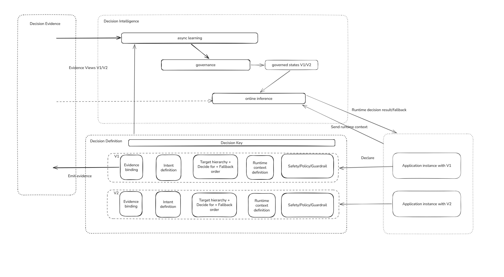

# Flaggo High-Level Design

## Purpose

This document describes the high-level design for Flaggo: an AI-native runtime decisioning system that fulfills the vision in [MANIFESTO.md](MANIFESTO.md) and supports the first product experience in [HERO_SCENARIO.md](HERO_SCENARIO.md).

This is intentionally not a detailed component specification. Specific API, SDK, storage, policy, telemetry, frontend, and agent designs should live in focused sub-documents later.

## Product thesis

Flaggo gives running software a governed way to ask:

> Given this decision definition, available decision evidence, and approved governed state when it exists, what should happen now?

The application still owns the resulting action. Flaggo owns the decisioning control plane and runtime decision provider around selected runtime choices.

The refined mental model is documented in [MENTAL_MODEL.md](MENTAL_MODEL.md). In short, the top-level concepts are:

```text
Decision Definition
  declares what may be decided and how targets/evidence/fallback resolve

Decision Evidence
  provides runtime facts, observations, evidence views, quality, and provenance

Decision Intelligence
  analyzes evidence and produces bounded proposals

Decision Lifecycles
  validate, approve, activate, observe, and transition governed state

Runtime Decision Execution
  applies compatible governed state to one application request
```

Canonical loops:

```text
DecisionDefinition + DecisionEvidence + outcomes + objectives
  -> Decision Intelligence
  -> DecisionProposal
  -> Decision Lifecycle
  -> GovernedDecisionState

DecisionDefinition + runtime context + compatible GovernedDecisionState + policy
  -> Runtime Decision Execution
  -> RuntimeDecisionResult, possibly containing fallback
```

## Core concepts

### Decision definition

A decision key is the stable developer-facing name where application code delegates a runtime choice to Flaggo. It answers: **what decision family is being delegated?**

Examples include `tetris.dropInterval`, `checkout.fraudReviewRequired`, `api.retryPolicy`, `llm.modelRoute`, and `workflow.escalationAction`.

A decision definition is the versioned semantic contract behind a key. It answers: **what may be decided and how should it resolve for this revision?** It owns signal declarations, typed intent, inference configuration, safety constraints, and output contract/action space. It does not own governed state or concrete runtime results.

Detailed concept design: [DECISION_DEFINITION.md](DECISION_DEFINITION.md).

### Decision evidence

Decision evidence is what Flaggo knows from runtime facts, observations, telemetry, evidence views, quality signals, uncertainty, target identifiers, and provenance.

| Evidence concept | Answers | Example |
| --- | --- | --- |
| Runtime context | What is true right now? | board pressure is high |
| Runtime target | Who or what receives this decision now? | `session:game-456` |
| Evidence view | Which slice of telemetry is relevant? | `tetris.recentPlacementTimeMs` grouped by cohort over 24h |
| Application/build provenance | Which software artifact is calling for audit/operations? | `service=web`, `build=2026.07.25.1` |

Detailed concept design: [DECISION_EVIDENCE.md](DECISION_EVIDENCE.md).

### Target resolution

The decision definition declares a target hierarchy, and resolvers choose path-specific targets from that hierarchy:

| Target role | Chosen by | Example |
| --- | --- | --- |
| Runtime target | Runtime decision execution | `session:game-456` |
| Learning target | Async intelligence | `cohort:new_players` |
| Control target | Governance | `cohort:new_players` |
| Fallback target | Runtime/governance | `global` |

### Decision intelligence

Decision intelligence is the AI-native reasoning layer that turns decision definitions and decision evidence into `DecisionProposal` objects. For real-time adaptive decisions, it usually proposes a bounded strategy that can later be governed and executed against live context.

It answers: **how should Flaggo reason about what to do next before governance decides whether it is safe to apply?**

This is the layer that makes Flaggo more than a dynamic configuration or feature flag service. It can behave like an embedded data scientist or operator assistant: observe telemetry, compare outcomes, choose an analysis strategy, propose experiments, value changes, or bounded adaptation strategies, explain uncertainty, and recommend whether to hold, change, test, roll back, or fall back.

Decision intelligence should produce a **DecisionProposal**, not an automatically final runtime decision. A proposal can be a single value, an experiment, a rollout, or a bounded strategy.

Detailed concept design: [DECISION_INTELLIGENCE.md](DECISION_INTELLIGENCE.md).



### Decision lifecycles

Decision lifecycles validate proposals, apply policy and approval, activate `GovernedDecisionState`, and manage optimization, experiment, and rollout transitions through completion or rollback.

Detailed concept design: [DECISION_LIFECYCLES.md](DECISION_LIFECYCLES.md).

### Runtime decision execution

Runtime decision execution resolves compatible governed state and applies fixed resolution, strategy evaluation, deterministic variant assignment, rollout routing, override, or fallback for one application request.

Detailed concept design: [RUNTIME_DECISION_EXECUTION.md](RUNTIME_DECISION_EXECUTION.md).

### Runtime decision result

`RuntimeDecisionResult` is the output Flaggo returns to application code.

It should include:

- selected value or action,
- whether fallback was used,
- confidence/evidence status,
- policy result,
- explanation summary,
- audit correlation ID.

The application should be able to apply the result without knowing the internals of evidence aggregation, policy evaluation, or AI reasoning.

At a high level:

```text
DecisionDefinition + runtime context + compatible GovernedDecisionState
  -> fixed resolution, strategy evaluation, variant assignment,
     rollout routing, override, or fallback
  -> policy, target, and safety checks
  -> RuntimeDecisionResult, possibly containing fallback
```

## Hero scenario design target

The first complete design target is the Tetris `dropInterval` decision.

```text
Decision key: tetris.dropInterval
Decision definition: def_01JQ8Y7M6X3K9P2W4R5T6V7N8A / rev_01JQ8YB4E5H6J7K8M9N0P1Q2R3
Runtime target: session:game-456
Control target: cohort:new_players or global
Runtime context: userId, sessionId, cohort, currentLevel, deviceType, boardPressure, recentPlacementTimeMs, recoveryFailures
Evidence views: hard-drop rate, placement time, early game-over rate by session/cohort/global windows
Goals: keep gameplay challenging but playable
Policy constraints: min/max interval, max delta, cooldown, min evidence quality, max model uncertainty
Governed state: active value or strategy, previous value, cooldown, rollout, operator mode
Action space: numeric interval from 200ms to 1500ms
Fallback contract: 800ms default
```

This scenario should prove the smallest useful version of Flaggo:

1. A developer can declare a stable decision key and bounded decision definition.
2. The app can emit observations and ask for a decision for a runtime target.
3. Flaggo can resolve evidence views, governed state, goals, policy, and uncertainty.
4. Async intelligence can produce a proposal for a decision definition and control target.
5. The decision lifecycle can approve, limit, hold, roll back, fall back, or activate the strategy.
6. Runtime decision execution can apply governed state against live game context.
7. The app can safely apply a value or fallback.
8. An operator can inspect why the decision happened.

## System components

### 1. [Client library](design/client-library/README.md)

The client library is the developer-facing integration point.

Responsibilities:

- define decision keys and decision definitions,
- define action spaces and fallbacks,
- define or emit domain telemetry,
- pass runtime context when asking for decisions,
- receive decision responses,
- optionally apply code-declared fallback when the data plane is unavailable,
- surface contract/configuration errors without local fallback,
- preserve governed server fallback when policy, evidence, or state blocks adaptation,
- integrate with OpenTelemetry where configured.

The client library should make the runtime primitive feel natural:

```text
declare -> decide by observing
```

For the Tetris hero scenario, the TypeScript client is the first likely library target.

### 2. [Decision API service](design/decision-api/README.md)

The Decision API is the runtime service applications call when they need a `RuntimeDecisionResult`.

Responsibilities:

- receive decision requests,
- validate decision key, definition, runtime target, and application identity,
- resolve applicable decision definitions, target references, and signal configuration,
- fetch evidence views and governed state,
- evaluate policy constraints,
- execute compatible governed state through deterministic selection or approved strategy logic,
- return a value/action, explanation, confidence, policy result, and fallback status.

The Decision API must be fast, reliable, and safe-by-default. For a registered definition, if policy, evidence, or governed state prevents adaptation, it returns the registered fallback rather than pretending confidence exists. Missing, unknown, conflicting, or retired definition identity is a contract error, not a fallback decision.

Fallback provenance is explicit. A server-produced policy fallback is a normal audited `RuntimeDecisionResult` with `source: server`, policy result, decision ID, and audit ID. An explicitly configured client fallback caused by data-plane unavailability has `source: client-fallback` and cannot claim server policy, decision, audit, or exposure identity. Contract/configuration errors never become client fallback.

### 3. [Telemetry and evidence service](design/telemetry-evidence/README.md)

The telemetry/evidence service turns runtime observations into decision evidence.

Responsibilities:

- ingest domain events and OpenTelemetry-compatible signals,
- correlate events, metrics, traces, logs, and decision records,
- support local/runtime-target evidence and server-side aggregation,
- expose evidence snapshots to the Decision API,
- preserve enough evidence lineage for explanations and audits.

The service should support both direct Flaggo ingestion and integration through OpenTelemetry pipelines.

### 4. [Contract and registry service](design/contract-registry/README.md)

The contract/registry service stores the declared meaning of decisions.

It is a control-plane service. Definition registration is separate from application deployment and never occurs as a side effect of a runtime decision call.

Responsibilities:

- register stable decision keys,
- register versioned decision definitions,
- store action spaces,
- store fallback contracts,
- store goal definitions,
- store telemetry, signal references, and evidence view requirements,
- store target rules and resolution chains,
- version contract changes.

Contracts should be explicit and versioned because runtime decisions must be explainable after the fact.

### 5. [Policy service](design/policy/README.md)

The policy service is the safety gate.

Responsibilities:

- resolve applicable policies by decision definition and target,
- enforce hard constraints,
- evaluate evidence quality, model uncertainty limits, sample-size requirements, cooldowns, max deltas, approval requirements, and guardrails,
- block or require fallback when safety requirements are not met,
- produce stable reason codes for audit and operator visibility.

Policy is not advisory. It is part of the control plane.

### 6. [State service](design/state/README.md)

The state service tracks the current and historical state of decisions.

Responsibilities:

- active value/action per decision definition and control target,
- previous decisions,
- cooldown state,
- rollout or exposure state,
- operator overrides,
- paused/resumed mode,
- rollback transition metadata.

State lets Flaggo avoid stateless one-off guesses and prevents thrashing or conflicting decisions.

### 7. [Decision reasoning engine](design/reasoning-engine/README.md)

The decision reasoning engine executes the decision intelligence model and proposes the next candidate action.

Responsibilities:

- interpret evidence relative to goals,
- account for uncertainty,
- compare candidate values and strategies within the action space,
- choose an analysis mode such as qualitative reasoning, heuristic rules, experiment analysis, bandits, statistical models, or LLM-assisted reasoning,
- produce decision proposals or strategy proposals rather than directly applying runtime decisions,
- produce a rationale,
- hand candidate decisions to policy before application.

This engine may use AI, deterministic algorithms, statistical methods, bandits, rules, or hybrids. The design should not assume every decision requires an LLM.

### 8. [Audit and explanation service](design/audit-explanation/README.md)

The audit/explanation service records why decisions happened.

Responsibilities:

- persist decision request/response summaries,
- record runtime target, control target, evidence target references, policy target, evidence snapshot, policy result, confidence report, fallback usage, and reason text,
- correlate decisions with telemetry and traces,
- support operator review and debugging.

Auditability is required for trust. It is not optional observability.

### 9. [Operator console](design/operator-console/README.md)

The operator console is the human governance interface.

Responsibilities:

- list decision keys and definitions,
- inspect runtime/control/evidence/policy targets and resolution chains,
- view goals, policies, fallbacks, and active state,
- inspect recent decisions and explanations,
- pause/resume decisions,
- override values,
- approve, reject, or roll back changes,
- observe evidence quality and uncertainty.

The console should make Flaggo feel governed rather than magical.

## Control plane and data plane

Flaggo follows a cloud-service control-plane/data-plane model:

| Plane | Responsibility |
| --- | --- |
| Control plane | Validate/apply definition bundles; manage immutable definitions, policies, strategies, state lifecycle, and operator actions. |
| Data plane | Evaluate an exact pre-registered definition and confirm exposure. |
| Application deployment | Build and deploy application code; remains outside Flaggo ownership. |

For the MVP, trusted application/bootstrap startup acts as a control-plane client. This coordinates two separate APIs; it does not move registration into the decide path or make Flaggo responsible for deployment.

```text
application code
  -> static SDK extraction creates canonical bundle

application deployment (independent)
  -> trusted application/bootstrap startup
  -> control-plane validate/apply
  -> registered definition identity
  -> initialize data-plane client
  -> runtime request carries exact definitionId + revision + contractDigest
```

Future control-plane client experiences can include startup verify-only, manual CLI, CI/CD, GitOps, init/deployment hooks, and registry-first tooling. The service boundary remains unchanged.

If startup registration is skipped or fails, the application may continue without Polari, but decision calls cannot. The data plane never selects an older revision implicitly or converts registration failure into local fallback.

Detailed SDK/tooling UX: [Control Plane and Data Plane UX](design/client-library/CONTROL_DATA_PLANE_UX.md).

## High-level intelligence, lifecycle, and runtime flow

Flaggo separates proposal generation, lifecycle authority, and per-request execution.

The **runtime decision execution path** serves application requests:

```text
Application code
  -> emits domain telemetry through client library
  -> asks Decision API for decision(definition, runtime target, runtime context)

Decision API
  -> loads decision definition
  -> resolves runtime target, control target, evidence views, policy, and fallback
  -> fetches evidence snapshots
  -> fetches compatible GovernedDecisionState
  -> executes fixed value, approved strategy, variant assignment,
     rollout routing, override, or fallback
  -> applies deterministic runtime policy checks
  -> records audit/explanation
  -> returns RuntimeDecisionResult, possibly containing fallback

Application code
  -> applies returned value/action
  -> emits outcome telemetry
```

The **decision intelligence path** analyzes evidence outside the application's request/response path:

```text
Telemetry changes, schedule, operator request, definition activation, rollout review, or drift
  -> decision intelligence
  -> select decision definition + control target work item
  -> observe evidence views and governed state
  -> interpret findings
  -> choose analysis mode
  -> generate and evaluate candidate values or strategies
  -> produce DecisionProposal
```

The **decision lifecycle path** turns proposals into authority:

```text
DecisionProposal
  -> validate contract, workflow permission, target authority, and policy
  -> approve, limit, hold, reject, or await approval
  -> activate and transition GovernedDecisionState
  -> observe optimization, experiment, or rollout progress
  -> complete, supersede, expire, or roll back
```

Runtime decision execution then applies deterministic, bounded, policy-gated state and returns a `RuntimeDecisionResult`.

Rollback is not a kind of governed-state payload. A rollback proposal transitions authority by activating a replacement or previous known-safe state and marking the replaced state `rolled-back`.

Governed state lifecycle:

```text
DecisionProposal: proposed -> validated -> pending-approval | approved | rejected
GovernedDecisionState: pending -> active -> superseded | expired | completed | rolled-back
```

Approval can be automatic for low-risk changes within typed constraints and sufficient evidence only when deployment or environment policy grants that authority. Human approval is required for high-impact strategies, policy exceptions, insufficient evidence quality, excessive model uncertainty, weak expected outcome, overlapping target conflicts, or regulated/business-critical decisions.

Cross-cutting flows keep the system declared, evidenced, audited, and improved over time:

| Flow | Purpose |
| --- | --- |
| Contract sync | Validates and registers versioned decision definitions, supported targets, policies, signal declarations, inference configuration, and fallbacks from code/deploy bundles. |
| Telemetry ingestion | Turns application and OpenTelemetry signals into evidence views and snapshots. |
| Audit and explanation | Records decision requests, proposals, policy outcomes, evidence references, fallbacks, and explanations. |
| Feedback and learning | Feeds runtime outcomes back into evidence, future proposals, models, heuristics, and experiment design. |

Detailed lifecycle design: [DECISION_LIFECYCLES.md](DECISION_LIFECYCLES.md).
Detailed runtime design: [RUNTIME_DECISION_EXECUTION.md](RUNTIME_DECISION_EXECUTION.md).

## Target and resolution model

Target and scope resolution are central to Flaggo, but the resolved references have different meanings.

For a request like:

```text
definitionId = def_01JQ8Y7M6X3K9P2W4R5T6V7N8A
revision = rev_01JQ8YB4E5H6J7K8M9N0P1Q2R3
runtime target = session:game-456
```

Flaggo may resolve:

```text
runtime target: session:game-456
control target: cohort:new_players
evidence views:
  tetris.recentPlacementTimeMs / session:game-456 / 2m / filters:{}
  tetris.earlyLossRate24h / cohort:new_players / fixed-window / filters:{}
policy: cohort:new_players -> global
fallback: global 800ms
```

This is what lets Flaggo approve behavior at manageable control boundaries while applying it safely to high-cardinality runtime targets.

## Initial boundaries

The first design should stay narrow:

- one hero decision: `tetris.dropInterval`,
- one client library: TypeScript,
- one default Decision API,
- one telemetry/evidence path,
- one deterministic policy evaluator and lifecycle governance stage,
- one approved numeric rule strategy executor,
- one audit trail,
- one basic operator view.

The goal is not to implement every scenario. The goal is to prove the primitive end-to-end.

## Explicit non-goals for the first design

- Full replacement for feature flag platforms.
- Full replacement for observability platforms.
- General-purpose workflow orchestration.
- Unbounded autonomous code execution.
- LLM-only decisioning.
- Complex multi-tenant enterprise governance from day one.

## Design principles

1. **Explicit over implicit**: decisions, definitions, targets, goals, policies, action spaces, and fallbacks must be named.
2. **Governed over magical**: policy and fallback are first-class.
3. **Evidence-aware over telemetry-blind**: decisions must be grounded in runtime context and observed behavior.
4. **Uncertainty-aware over false precision**: weak evidence should block, suggest, or fall back.
5. **Scoped over global-by-default**: every decision should know where it applies.
6. **Auditable over opaque**: every decision should be reconstructable.
7. **Pluggable over closed**: integrate with OpenTelemetry, existing config systems, and future decision engines.

## Future focused design documents

Later sub-documents should define:

- client SDK design,
- decision request/response API,
- decision contract schema,
- decision intelligence model,
- scope and resolution rules,
- telemetry/evidence model,
- policy model,
- state model,
- audit/explanation model,
- operator console UX,
- Tetris integration design.
