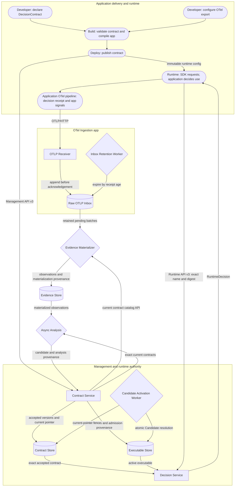

# Application boundaries and lifecycle

## Purpose and status

This document is the canonical map of how Flaggo clients, runnable apps,
workers, and durable stores participate in the end-to-end lifecycle. Detailed
wire behavior remains authoritative under `contracts/`; app-specific documents
define each boundary in more depth.

Five runnable composition roots are implemented:

- Contract Service;
- Decision Service;
- OTel Ingestion;
- Evidence Materializer; and
- Async Analysis.

## Diagram notation

| Shape or line | Meaning |
| --- | --- |
| Rounded node | Application, SDK, build, or deployment activity outside the server |
| Rectangle | Synchronous request-serving Web API component |
| Diamond | Asynchronous, periodic, or background worker component |
| Cylinder | Durable state boundary |
| Solid arrow | Implemented data or control flow |
| Dashed arrow | Deferred or optional flow |

Shapes identify execution models, not deployment topology or instance counts.
A component is a conceptual grouping that may have one or many processes or
replicas when its concurrency contract permits. Conversely, one process may
host more than one role: the current OTel Ingestion binary hosts both the
receiver API and inbox-retention worker.

## Canonical lifecycle

The central authority rule is visible in the loop: Async Analysis may propose
an immutable candidate, but the candidate returns to Contract Service.
Contract Service validates it, persists it, and atomically changes activation.
Async Analysis never writes Executable Store or runtime authority directly.

## Lifecycle walkthrough

1. **Author and build.** A developer declares a `DecisionContract`, configures
   application telemetry, and validates the local wire shape while building the
   application. Build performs no server mutation.
2. **Deploy and accept.** Deployment binds authority, publishes the complete
   contract to Contract Service, receives the server-computed digest, and
   distributes immutable runtime configuration containing exact contract
   bindings and service endpoints.
3. **Establish runtime authority.** Contract Service persists the accepted
   version, generates the required default executable, validates it, and
   activates it before reporting the version ready.
4. **Evaluate online.** The SDK sends complete runtime input for one exact name
   and digest. Decision Service reads that accepted contract and its active
   executable, evaluates deterministically, and returns a decision. The
   application alone decides whether and how to apply the result.
5. **Collect telemetry.** The SDK emits a decision-received observation and the
   application emits ordinary logs, metrics, and traces through its own
   OpenTelemetry pipeline. Decision receipt is not proof of application
   exposure or outcome.
6. **Retain and materialize.** OTel Ingestion appends each accepted export
   request before acknowledgement. Its retention worker expires raw requests by
   receipt age. Evidence Materializer independently reads pending requests
   forward and writes durable query-ready observations.
7. **Analyze and propose.** Async Analysis reads
   materialized observations plus the exact current contract, correlates usable
   evidence, records its method and evidence provenance, and proposes an
   immutable candidate to Contract Service.
8. **Validate and replace.** Contract Service validates and admits the
   candidate without changing authority. Its paced activation worker selects
   the newest eligible Candidate and performs one atomic current-fenced
   replacement. Later runtime requests observe either the complete previous
   activation or the complete replacement.

## Responsibility matrix

| Component | Role and status | Consumes | Produces and owns | Must not do |
| --- | --- | --- | --- | --- |
| Application and SDK | Client boundary, implemented | Authored contract bindings, application attributes, immutable runtime configuration | Complete `RuntimeInput`, decision use, decision-received telemetry, and ordinary app telemetry | Discover a moving contract version, grant runtime authority, or treat decision receipt as proven exposure |
| Contract Service | Web API plus activation worker, implemented | Management requests and immutable candidate submissions | Accepted contract identity, management current pointer, executable artifacts and provenance, candidate validation, and atomic activation | Evaluate runtime requests, ingest evidence, correlate observations, or delegate activation authority |
| Decision Service | Web API, implemented | Exact contract name and digest, complete input, accepted contract, and active executable | One bounded `RuntimeDecision`; no semantic per-request durable state | Select latest versions, generate or activate executables, query evidence, or run analysis |
| OTel Ingestion | Web API plus retention worker, implemented | OTLP/HTTP export requests and inbox retention settings | Durable Raw OTLP Inbox append, capacity accounting, and receipt-age retention | Extract declared authority, select contract evidence, materialize signals, or delete based on consumer progress |
| Evidence Materializer | Background worker, implemented | Retained inbox batches and optional current-contract catalog | Evidence Store observations, inbox provenance, diagnostics, conflicts, catalog cache, and forward checkpoint | Acknowledge ingestion, own inbox retention, correlate evidence, revisit completed batches after catalog changes, or generate candidates |
| Async Analysis | Background worker, implemented | Exact current contracts and materialized Evidence Store observations | Analysis-run state, evidence selection and method provenance, and immutable candidate proposals | Read Raw OTLP as a fallback, write activation state, bypass candidate validation, or enter the runtime request path |

Operator Console is a planned management client rather than a server authority.
It must use service APIs and cannot gain authority by reading or writing store
tables directly. Any future authentication authorizes loaded resources rather
than selecting them by credential claims.

## Durable-state ownership

| State boundary | Semantic owner | Other access | Lifecycle invariant |
| --- | --- | --- | --- |
| Contract Store | Contract Service | Decision Service reads exact accepted versions; workers use Contract Service APIs instead of its tables | Versions are immutable by `contractDigest`; only Contract Service moves the management current pointer |
| Executable Store | Contract Service | Decision Service reads active lifecycle state and immutable artifacts | Artifacts are immutable; only Contract Service candidate admission and activation change lifecycle authority |
| Raw OTLP Inbox | OTel Ingestion | Evidence Materializer reads retained batches | Receiver appends; inbox retention expires by receipt age independently of materialization |
| Materializer checkpoint and catalog cache | Evidence Materializer | No other app mutates them | One active materializer advances one global forward checkpoint per database; producing versions are provenance and neither version nor catalog changes backfill completed batches |
| Evidence Store observations and materialization provenance | Evidence Materializer | Async Analysis reads through the Evidence Store contract | Observations outlive raw inbox retention; decision observations preserve an emitted contract digest, while ordinary application observations have no eager contract association |
| Analysis run state and evidence/method provenance | Async Analysis | Contract Service receives candidate provenance at admission | A run is scoped to an exact contract digest; superseded work cannot activate |

The current local implementation physically co-locates several schemas in
SQLite. Co-location is not shared ownership. Apps depend on domain/store
contracts or explicit HTTP APIs, and no app project references another app
project.

## Authority transitions

| Transition | Authority holder | Result |
| --- | --- | --- |
| Establish validation or deployment scope | Contract Service | Tenant, application, and environment declared by the submitted contract |
| Claim contract-name ownership | Contract Service | The first accepted declared authority owns the name globally |
| Accept contract | Contract Service | Server-computed immutable `contractDigest` containing declared authority and a name-keyed management current pointer |
| Generate candidate | Contract Service for default/authored paths; Async Analysis for learned paths | Immutable proposal bound to one exact digest; no runtime authority |
| Validate and admit candidate | Contract Service | Contract-conformant immutable executable and provenance |
| Activate executable | Contract Service | Atomic `RuntimeActivation[contractDigest]` mapping |
| Resolve runtime executable | Decision Service | One immutable active executable captured for the request |
| Derive current telemetry scope | Evidence Materializer | Declared authority from required OTLP Resource attributes; not authentication authority |
| Interpret evidence | Async Analysis | Evidence scoped to an exact contract digest and recorded provenance |

Authentication for OTel writes is not implemented. OTel Ingestion therefore
does not establish authority from credentials; Evidence Materializer derives
the current declared evidence scope from `flaggo.*` Resource attributes.
Decision observations preserve the exact contract digest emitted by the SDK as
a source fact. That fact does not eagerly associate ordinary application
observations with a contract; Async Analysis still interprets which
observations are usable for each exact contract.

## Dependency and failure isolation

### Synchronous request paths

| Path | Required dependencies | Explicitly not required |
| --- | --- | --- |
| Contract deployment and reads | Contract Store, Executable Store, validation and generation modules | Decision Service, OTel Ingestion, Evidence Materializer, Evidence Store, Async Analysis |
| Runtime decision | Contract Store, Executable Store, evaluator | Contract Service process availability, OTel Ingestion, Raw OTLP Inbox, Evidence Materializer, Evidence Store, Async Analysis |
| OTLP acknowledgement | Raw OTLP Inbox capacity and durable append | Contract Service, Decision Service, materialization progress, evidence freshness, Async Analysis |

### Asynchronous paths

- Retention failure makes OTel Ingestion unhealthy; it does not authorize
  receiver-side deletion or change runtime decisions.
- Materializer delay increases backlog and evidence staleness but cannot change
  acknowledgement of already accepted OTLP requests or block runtime.
- Contract-catalog refresh failure retains the last valid materializer catalog;
  built-in Flaggo observations remain independently recognizable.
- Raw inbox expiry may limit future rematerialization, but already persisted
  Evidence Store observations remain durable.
- Planned analysis failure, no-candidate completion, or candidate rejection
  leaves the currently active executable unchanged.
- Candidate activation failure is explicit and leaves the prior complete
  activation intact.

Contract and Decision readiness depend only on the authority stores they use.
Decision readiness and in-flight requests never depend on telemetry
availability, evidence freshness, or learning success.

## Multiplicity and scaling invariants

- API components may have multiple instances when their shared authority and
  consistency contracts preserve the documented transitions.
- Decision Service retains no semantic request session, so replicas can serve
  independent requests against coherent authority stores.
- OTel Receiver and retention are separate conceptual roles but are co-hosted
  by the current executable; this document does not require that topology.
- Exactly one Evidence Materializer may be active per database under the
  current forward-checkpoint design.
- Async Analysis uses durable claims to remain single-flight per contract
  digest across worker instances.
- Contract Service activation workers may run on multiple instances; lifecycle
  version comparisons make one transition win while conflicting workers yield.

## Related documents

- [Architecture overview](OVERVIEW.md)
- [Contract clients and Contract Service](CONTRACT_SERVICE.md)
- [Runtime client and Decision Service](RUNTIME.md)
- [Evidence and learning](EVIDENCE.md)
- [Decision authority](AUTHORITY.md)
- [Decision contract lifecycle](../contracts/LIFECYCLE.md)
- [Runnable app composition roots](../../../apps/README.md)
